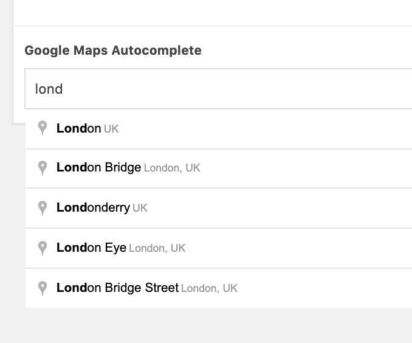

# ACF GoogleMaps Autocomplete

Adds a new field type to ACF so you can use Google Maps Autocomplete anywhere inside your admin area without displaying the full ACF map component.

Useful for long lists of locations etc.

## Installation

- Copy the folder into your wp-content/plugins folder
- Make sure you have included the standard ACF call to your Google Map API key in your functions.php file
- Activate ACF and this plugin
- Create the new ACF field, selecting the new GoogleMaps Autocomplete field type, under jQuery
- Enter, and pull the data out to the Front-End

This plugin will add 3 fields to be saved within your ACF data - address, lat, lng

It is up to you to decide how to display them on the Front-End and send the information to the map; I recommend using data attributes.

### Include this in your functions.php file

```php
function my_acf_init() {
  acf_update_setting('google_api_key', '**your_map_key_here**' );
}

add_action('acf/init', 'my_acf_init');
```

## Screenshot


